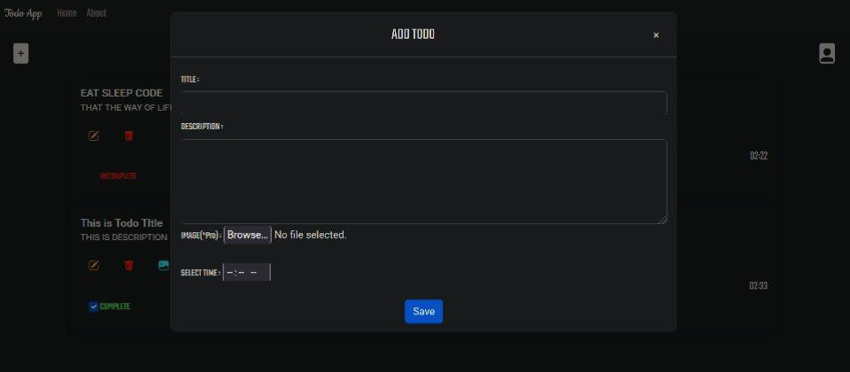

# TODO APP

A TODO webapp Based on Python Flask Framework

# UI
<p align="center">
  
</p>

<p align="center">
  
</p>

# Deploy Locally :
```
    # clone repo
    git clone https://github.com/DebXD/flask-todo-app && cd flask-todo-app

    # create virtual environment
    python3 -m venv env

    # activate environment
    . ./env/bin/activate

    # install required libraries
    pip install -r requirements.txt

    # fill required values to example.env by renaming to .env

    # run the app
    python app.py

